# Signing Platform — Enterprise Digital Signing Case Study

A public portfolio case study for a multi-tenant, cloud-connected digital document signing platform with a Wacom signature capture core. The system spans three connected surfaces — a **React/TypeScript enterprise admin console**, an **Android field-signing app**, and a **Windows branch signing agent** — all backed by a multi-tenant cloud API.

This project replaces manual, paper-based signing with an end-to-end digital workflow: dynamic forms are built once in the admin console, signed in the field or at a branch counter using a Wacom tablet, and the signed record (form data + signature + generated PDF) flows back to the cloud automatically, with a full audit trail behind it.

> **Note:** This repository is a public case study. Private source code, API keys, tenant/database files, certificates, internal URLs, and production configuration are intentionally excluded. Everything below reflects the real, running system via screenshots and architecture description only.

---

## Project Overview

The platform serves organizations — currently modeled around **banking and hospital clients** — that need a compliant, auditable way to capture signatures and structured data outside a traditional office: at a customer's desk, a hospital intake counter, or a bank branch.

Three clients talk to one multi-tenant cloud backend:

| Surface | Who uses it | What it does |
|---|---|---|
| **Enterprise Admin Console** (web) | Back-office admins | Build forms, manage signing jobs, review submissions, manage users/roles, register branch agents, review the audit trail |
| **Android Field App** | Field officers | Log in, pick a form or job, capture structured data and a Wacom signature, generate a signed PDF record, sync to the cloud |
| **Windows Branch Signing Agent** | Branch/desk staff | A lightweight desktop agent that polls the cloud over outbound HTTPS, picks up pending signing jobs, captures a Wacom signature locally, and syncs the signed PDF back — no inbound network access required |

---

## My Role

**Full-Stack Developer — Cloud Backend, Admin Console, Android & Windows Clients**

I designed and built the multi-tenant cloud API, the React/TypeScript admin console, the Android signing app's forms/signature/sync pipeline, and the bridge that connects the legacy Windows desktop signing app to the cloud (job polling, signature capture, and signed-PDF sync-back).

---

## Key Features

**Cloud & Admin Console**
- Multi-tenant architecture — one platform, isolated data per client (bank, hospital, etc.)
- Dynamic form builder with a live field preview and JSON schema output (text, number, date, multiline, select, and signature field types)
- Signing job lifecycle tracking (pending → in progress → completed / failed)
- Submission review with search, filtering, and CSV export
- Branch signing agent registry — register, monitor online/offline status, and rotate API keys per branch machine
- Role-based user management (Admin / Field Officer roles) with password reset and activation controls
- Full audit trail of security-sensitive admin actions (user changes, key rotations, agent registration, etc.)
- Dashboard analytics — job status mix, platform activity, and operational trend charts

**Android Field App**
- Login with role-aware session (Field Officer / Admin)
- Dynamic form rendering driven entirely by the form schema from the cloud
- Native Wacom Ink SDK signature capture embedded directly in the form flow
- On-device generation of a signed PDF record with the rendered signature and full answer set, previewed before upload
- Local drafts, sync queue, and submission history for spotty-connectivity field use

**Windows Branch Signing Agent**
- Background agent that polls the cloud for pending signing jobs over outbound HTTPS only (no inbound ports, no VPN)
- Native OS notification when a new signing job arrives
- Wacom signature capture dialog scoped to the specific document/purpose (e.g. loan approval)
- Automatic signed-PDF generation and sync-back to the cloud once the job completes
- Designed to sit on top of an existing legacy desktop signing app without disrupting branch staff's workflow

---

## Tech Stack

### Cloud Backend
- ASP.NET Core Web API
- Entity Framework Core
- Multi-provider persistence: SQLite, PostgreSQL, SQL Server
- JWT authentication, role-based authorization
- Docker, AWS EC2, ECR, nginx reverse proxy

### Admin Console
- React + TypeScript
- REST API integration
- Component-driven dashboard, forms, and audit UI

### Android
- Kotlin
- Jetpack Compose
- MVVM architecture
- Retrofit, Room, Hilt
- Wacom signature SDK integration
- PDF generation (QuestPDF-based pipeline on the backend, rendered signature embedded client-side)

### Windows Branch Agent
- C# / .NET
- Wacom SDK integration
- Cloud job polling and sync-back service
- Windows notifications

### Workflow / Tools
- Git, GitHub
- API design, database-backed workflow design
- Multi-tenant system architecture planning
- Debugging and production troubleshooting

---

## System Architecture

- Each tenant (bank, hospital, etc.) gets isolated data behind a shared multi-tenant cloud API, with the underlying database provider configurable per environment (SQLite for lightweight/dev, PostgreSQL or SQL Server for production).
- Forms are defined once in the admin console as a JSON schema and rendered identically on Android and, where applicable, at the branch desk.
- Signing can happen two ways: **field-initiated** (an officer opens a form directly in the Android app) or **job-initiated** (an admin creates a signing job in the console, which is picked up by an Android device or a Windows branch agent).
- Branch machines never accept inbound connections — the Windows agent polls out over HTTPS, which keeps the security model simple for bank/hospital IT environments.
- Every signature is captured through the Wacom SDK (Ink SDK on Android, native Wacom capture on Windows) and embedded into a generated PDF alongside the structured form answers.
- All admin-side security-sensitive actions (agent registration, key rotation, password resets, user creation) are written to an audit trail for compliance review.

---

## Enterprise Admin Console

### Dashboard
Enterprise-wide overview of forms, submissions, signing jobs, and job status — with charts for job status mix, platform activity, and operational trend, plus recent submissions and recent signing jobs at a glance.

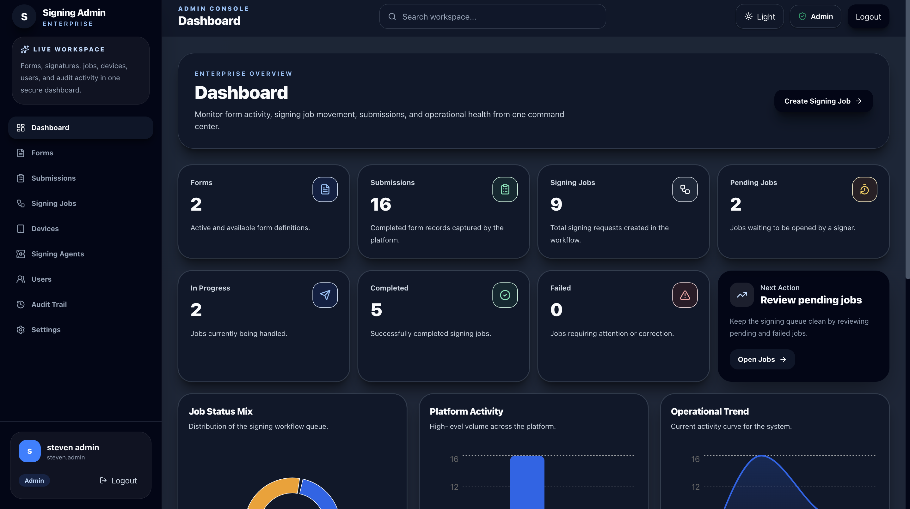
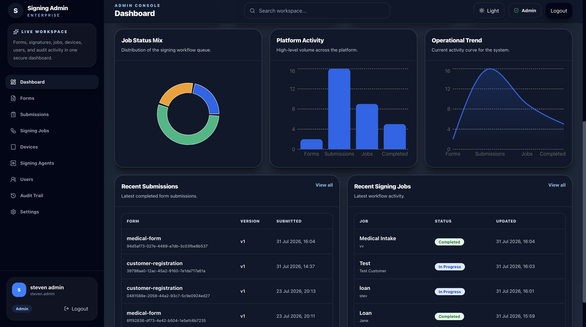

### Submissions
Every completed form submission captured from the field or a branch, searchable and filterable by form, submission ID, and date range, with CSV export.

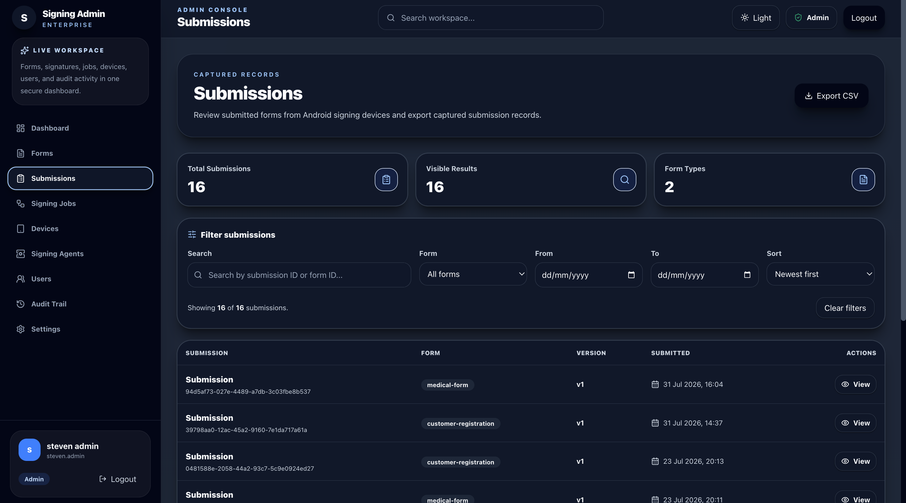

### Form Library & Builder
Forms are versioned and managed centrally. The builder supports multiple field types (text, number, date, multiline, select, signature), required-field toggles, a live field preview, and a generated JSON schema preview.

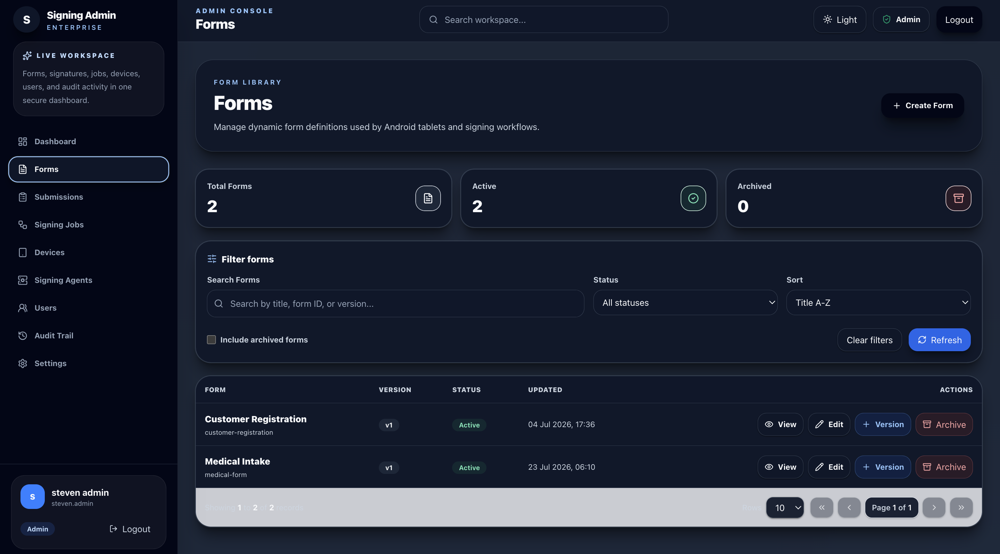
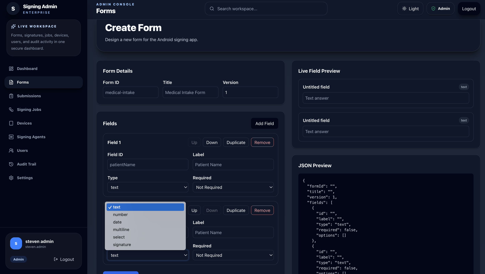

### Signing Agents
Branch Windows machines register here as signing agents. They check in over normal outbound HTTPS only — nothing connects inbound. Admins can monitor online/offline status and rotate an agent's API key.

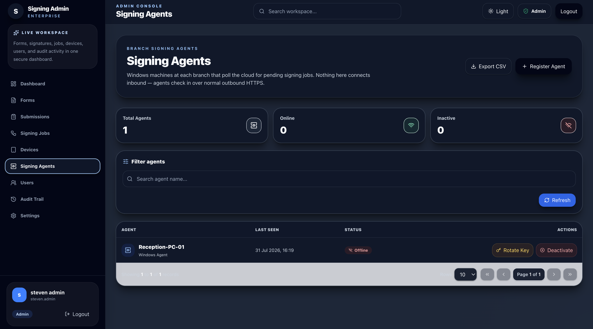

### User Management
Role-based access control for the admin portal itself — Admin and Field Officer roles, with account activation, deactivation, and password reset.

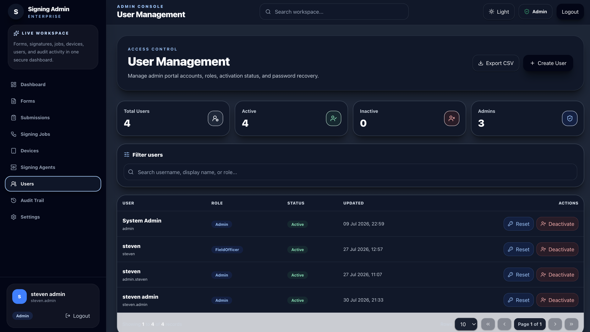

### Audit Trail
A security and compliance log of admin actions — agent registration, password resets, user creation, API key rotation — each with actor, action, entity, and timestamp.

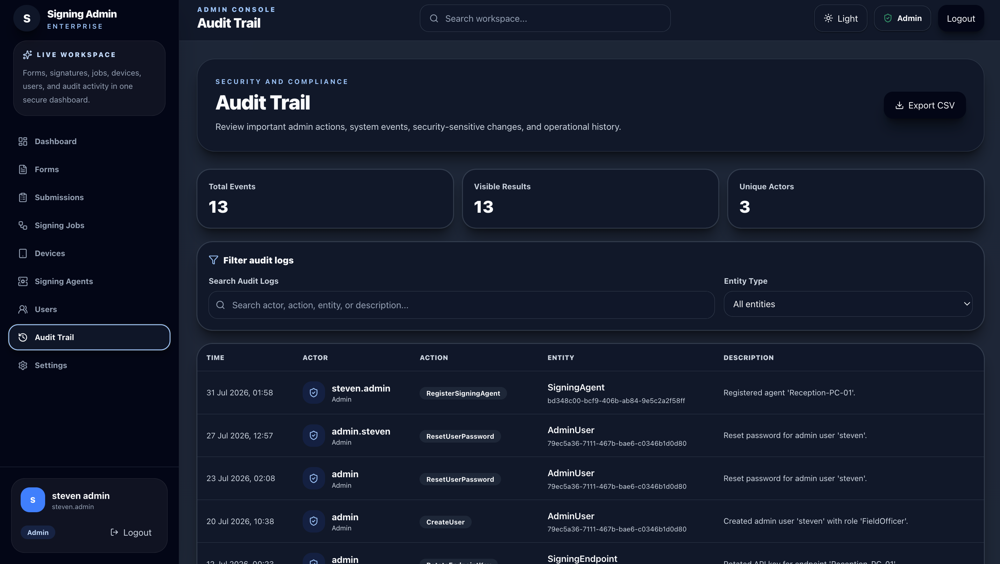

---

## Android Field App

The Android app is used by field officers to complete forms on the move. The flow: log in → pick a form or job → fill in the dynamic form → capture a signature on a paired Wacom device → preview the generated PDF record → sync to the cloud.

- A dynamic **Customer Registration** form rendering required text, number, and select fields, with unsaved-changes tracking and progress ("3/4 Answered").
- A native **Wacom Ink SDK** signature capture screen, launched in-flow, capturing the signature directly against the form's purpose.
- An on-device **PDF Record preview** generated immediately after signing, showing the submission ID, form version, timestamp, and every answer — including the rendered signature — before it syncs to the cloud.

> Screenshots for this section are being re-added — the source files were overwritten during upload (see note below) — but the flow above reflects the current, working app.

---

## Windows Branch Signing Agent

The legacy Windows desktop signing app now runs alongside a lightweight background agent that bridges it to the cloud, so branch staff keep their familiar signing screen while jobs flow in and signed documents flow back automatically.

### Cloud Job Received
The agent polls the cloud over outbound HTTPS and surfaces a native Windows notification the moment a job is queued for that branch.

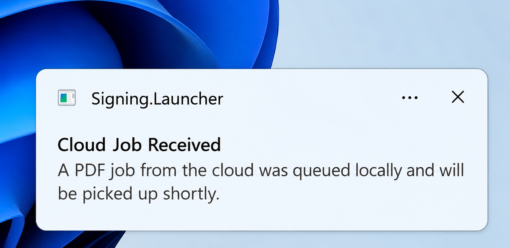

### Signature Capture
The desk officer captures the client's signature through a Wacom signature dialog scoped to the document's purpose (here, a loan approval), with signer name and timestamp recorded alongside the ink.

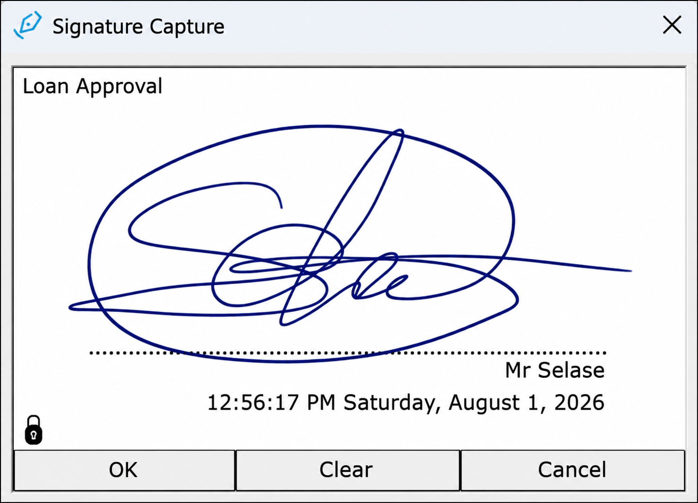

### Job Completed
Once signed, the app generates the completed document — in this case a bank overdraft approval — with the signature embedded and the job automatically synced back to the cloud as completed.

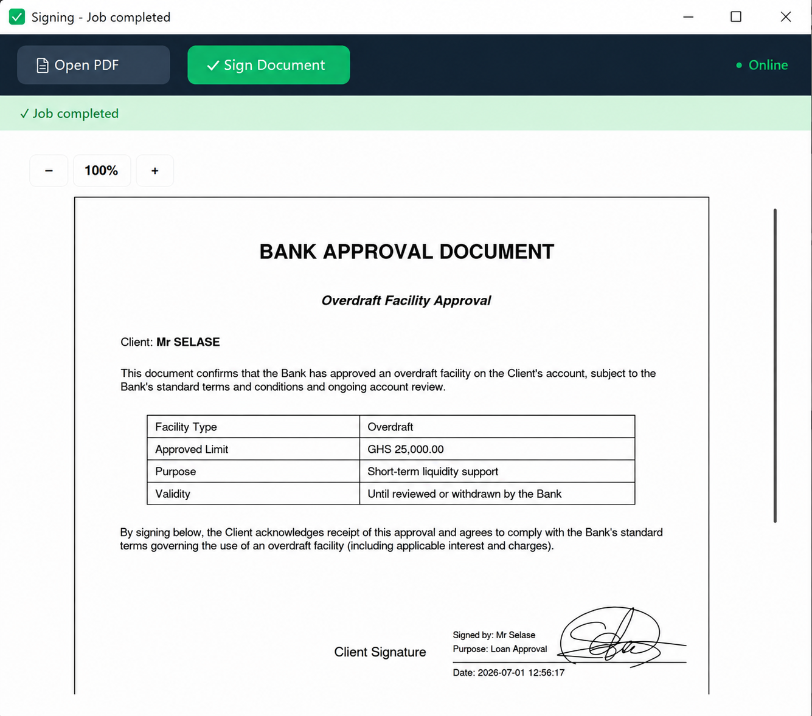

---

## Problem Solved

Many organizations — especially banks and hospitals — still depend on manual paper signing, physical document handling, and disconnected approval processes across branches or field visits.

This platform improves that workflow by:

- eliminating manual paper handling for structured, signature-required documents
- capturing legally meaningful signatures digitally via Wacom hardware, whether in the field or at a branch desk
- giving admins one place to design forms, launch signing jobs, and monitor status across every branch and device
- generating a consistent, signed PDF record for every submission automatically
- keeping branch machines secure with outbound-only polling instead of inbound connectivity
- providing a full audit trail for compliance and security review

---

## Future Improvements

- Deeper offline support for both Android and branch agents during connectivity gaps
- Expanded reporting and analytics in the admin console
- Additional identity/ID verification field types
- Broader database-provider parity testing across tenants
- Formal SDK-level automated testing for signature capture flows

---

## Repository Note

This repository is not the full production system.

It is a public portfolio summary created to show the platform's real workflow, screenshots, architecture direction, and technologies used across its cloud backend, admin console, Android app, and Windows branch agent.

Private source code, client/tenant data, certificates, database files, API secrets, and production configuration files are intentionally excluded.
