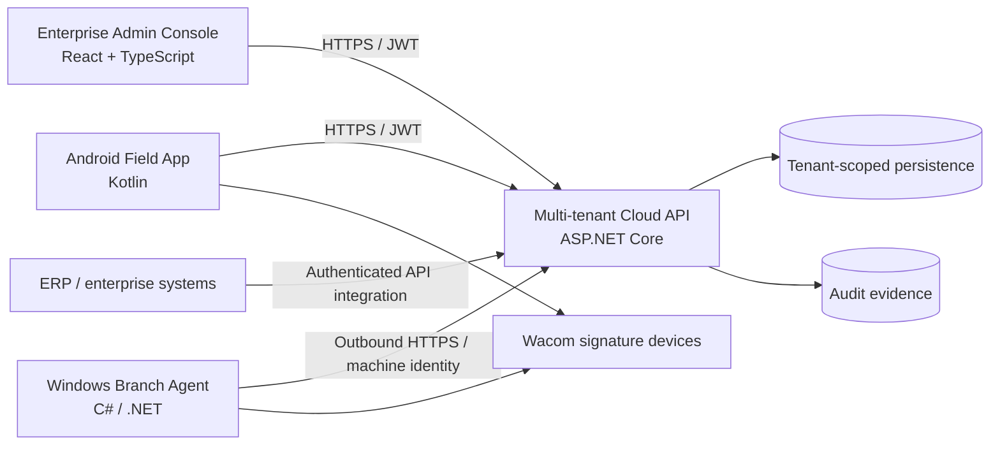

# Architecture Notes

This document explains the public architecture at a level useful for engineering review while intentionally omitting private production implementation details.

## System context

## Important engineering boundaries

### 1. Human identity and machine identity are different concerns

Interactive users authenticate as people and receive role-scoped access. Branch agents are machines and use a separate machine identity. Treating those identities separately reduces accidental privilege sharing and makes device rotation/revocation easier to reason about.

### 2. Tenant isolation is enforced at the data-access boundary

A multi-tenant system must not depend on UI filtering for isolation. Tenant context is carried into backend operations, and reads/writes are scoped to that tenant. The public sample under `samples/signing-jobs-api` demonstrates this principle in a deliberately small form.

### 3. ERP-facing job creation should be idempotent

Enterprise systems retry requests. A signing request therefore needs a stable external reference so a retry does not silently create duplicate signing jobs. The public API sample uses `(tenantId, externalReference)` as an idempotency boundary.

### 4. Branch connectivity is outbound-first

The Windows branch agent polls the cloud over outbound HTTPS rather than requiring an inbound connection to every branch PC. This is simpler to deploy in bank/hospital networks and avoids opening inbound ports merely to deliver a signing job.

### 5. Audit evidence is part of the workflow, not an afterthought

A signing system needs to answer more than "where is the PDF?" It should also preserve who/what performed important actions, lifecycle timestamps, verification state, and the relationship between the original job and completed output.

## Public sample vs. private product

The public repository demonstrates architecture, screenshots, reasoning, documentation quality, tests and selected clean-room code. The private product contains substantially more implementation detail, integrations, deployment configuration and commercial/licensed components.

That separation is intentional: reviewers get enough evidence to evaluate engineering ability without exposing production credentials, customer data, private endpoints, certificates or third-party licensed source/material.
